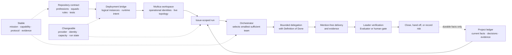
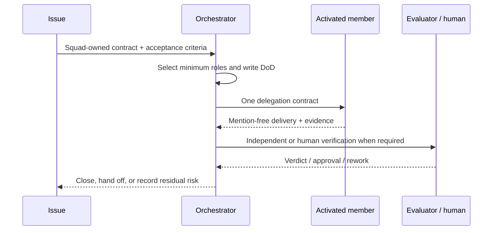

# Multica Agent Team

> A reusable, public reference model for coordinating specialized AI agents on Multica.
>
> 一个公开、可复用的 AI Agent 协作参考模型，用于在 Multica 上组织专业角色、Squad 和可验证的 Issue 流程。

[English](README.en.md) · [中文 / Chinese](README.md) · [Operating model](docs/operating-model.md) · [Official outreach kit](docs/official-outreach.md)

<p align="center">
  
  
  
</p>


> The diagram above is a committed SVG, so it renders directly on the GitHub README page. The editable Mermaid source is kept below for readers who want to inspect the flow.

## English

### What this project is

Multica Agent Team is the Git source of truth for a reusable agent company. It separates stable professional capability from deployable agent identities, long-lived Squad routing, and short-lived Issue runs. This public reference project is designed to make multi-agent work understandable, reviewable, and portable across model providers.

The current baseline contains seven Profession Profiles, ten intended Agent Instances, and five persistent functional Squads. Issues are assigned to an owning Squad by default. A Squad does not activate its entire roster for every task: its active leader selects the smallest sufficient team and gives each activated role a bounded Definition of Done.

### The core idea: stable contract, changeable deployment

The project has a deliberately clear boundary:

| Stable and versioned in this repository | Changeable at deployment or run time |
|---|---|
| Profession responsibilities and evidence contracts | Runtime provider and model selection |
| Squad missions, routing, entry/exit criteria | Which identities are mapped to logical instances |
| Company rules and Issue/DoD protocol | Current Issue, project facts, and run state |
| Templates, scripts, tests, and review gates | Capacity, activation choices, and operational credentials |



The repository owns the contract. Deployment owns operational identity. A run owns its temporary context. Reviewed facts and decisions may return to the Project ledger; chat logs, metrics, and traces do not become product truth automatically.

### How a run works



Every delegation defines an observable outcome, required evidence, verification level, and a rework cap. This keeps model judgment in ambiguous work while deterministic code handles routing, retries, validation, counting, sorting, and status transitions.

Each baseline Squad declares a Codex-backed fallback for a primary leader failure before tool execution; the owning Squad and contract stay unchanged, and the entry failure does not consume a rework round. Evaluation uses DeepSeek as the intended primary adversarial lane and Codex as the second independent/capacity lane. Evaluators remain independent, and authors never verify their own work.

### What is included

- Seven reusable professions: Orchestrator, PM, Designer, Engineer, GTM, Evaluator, and Researcher.
- Five baseline Squads: Discovery, Experience, Delivery, Growth, and Reliability.
- Non-destructive topology and content bridges to Multica.
- A PR-Sweep workflow with independent review lanes and machine-readable review state.
- Templates for PRDs, architecture specs, change proposals, evaluations, incidents, feedback, and pull requests.
- Tests for the synchronization and review-routing behavior.

### Quick start

```bash
git clone https://github.com/stone16/multica-agent-team.git
cd multica-agent-team

# Read-only plans are the default.
scripts/sync-topology.py
scripts/sync-multica.sh

# Run repository checks.
tests/sync-topology.test.py
tests/sync-multica.test.sh
tests/pr-sweep.test.sh
```

The sync scripts are intentionally dry-run by default. Applying changes requires the repository's clean-`main` safety contract and ambient authentication; operational UUIDs, mention links, tokens, and private environment values must not be committed.

### Explore the repository

| Start here | Purpose |
|---|---|
| [`workspace-context.md`](workspace-context.md) | Company-wide rules and memory boundaries |
| [`agents/`](agents/) | Stable Profession Profiles |
| [`squads/`](squads/) | Persistent Squad definitions and instructions |
| [`deployments/agents.json`](deployments/agents.json) | Neutral logical deployment intent |
| [`scripts/`](scripts/) | Sync and reconciliation bridges |
| [`templates/`](templates/) | Structured delivery artifacts |
| [`docs/operating-model.md`](docs/operating-model.md) | Full technical operating model |
| [`docs/official-outreach.md`](docs/official-outreach.md) | Ready-to-review official outreach material |

### Project status and contribution

This repository is an evolving operating model. Contributions should preserve the separation between profession, instance, Squad, run, and ledger. Before opening a change, read [`AGENTS.md`](AGENTS.md) and [`CLAUDE.md`](CLAUDE.md); they are required to remain byte-identical.

### License and attribution

This project is open source under the [Apache License 2.0](LICENSE). You may use, modify, and distribute it subject to the license requirements, including retaining applicable copyright, license, and [NOTICE](NOTICE) attribution information and adding prominent notices to modified files.

Forks and derivative projects may accurately state that they are based on Multica Agent Team, but must not imply official status or maintainer endorsement. See the [trademark and attribution policy](TRADEMARKS.md) for details. For citation metadata, see [CITATION.cff](CITATION.cff).

## About / 关于本项目

Multica Agent Team is a reusable, evidence-driven public reference model for multi-agent teams: stable professions and Squad contracts live in Git, while deployment identity and run context remain changeable. It helps teams coordinate AI work with explicit ownership, bounded delegation, independent verification, and durable artifacts.

Multica Agent Team 是一个以证据为驱动的多 Agent 协作操作模型：稳定的专业和 Squad 契约进入 Git，部署身份与每次运行上下文保持可变。它通过明确负责人、有边界的委派、独立验证和可沉淀的交付物，帮助团队更可靠地组织 AI 工作。

**Repository:** <https://github.com/stone16/multica-agent-team><br>
**Documentation:** [`docs/operating-model.md`](docs/operating-model.md)<br>
**Official outreach kit:** [`docs/official-outreach.md`](docs/official-outreach.md)

### GitHub discovery / GitHub 标签

This repository is organized around Multica and AI-agent discovery topics: `multica`, `multica-ai`, `multica-agents`, `multica-platform`, `ai-agents`, `multi-agent-systems`, `agent-orchestration`, `ai-agent-team`, `ai-workflows`, and `llm`.

GitHub Topics are configured on the repository itself. They are intentionally aligned with the actual content here, so Multica remains the primary product and ecosystem keyword rather than a generic afterthought.
