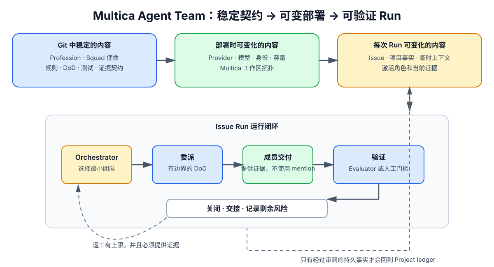

# Multica Agent Team

> 一个公开、可复用的 AI Agent 协作参考模型，用于在 Multica 上组织专业角色、Squad 和可验证的 Issue 流程。

[English / English README](README.md) · [中文 / Chinese](README.zh-CN.md) · [完整运行模型](docs/operating-model.md) · [官方对接宣传包](docs/official-outreach.md)

<p align="center">
  
  
  
</p>



> 这张图是提交到仓库的 SVG，因此会直接显示在 GitHub README 页面中。下方英文 README 还保留了可检查的 Mermaid 流程图源码。

## 项目是什么

Multica Agent Team 是一个公开的、可复用的 Agent 公司 Git 事实源，核心关键词是 Multica、AI agents、multi-agent systems 和 agent orchestration。它把以下对象明确分开管理：

- 稳定的 Profession Profile：角色职责、判断边界、工具和证据契约。
- 可部署的 Agent Instance：运行时、模型、容量和实际身份映射。
- 持久化 Squad：使命、路由、成员能力和进入/退出条件。
- Issue-scoped Run：一次具体任务的目标、上下文、证据和剩余风险。
- Project ledger：经过审阅后可以长期保留的事实、决策和交付物。

当前基线包含七个 Profession Profile、九个预期 Agent Instance 和五个持久化功能 Squad。每次任务不会默认唤起整个 Squad；Orchestrator 会选择足够完成任务的最小角色集合，并为每个角色定义边界清晰的 Definition of Done。

## 核心理念：稳定契约，部署可变

| 仓库中稳定、可版本化的内容 | 部署或运行时可变化的内容 |
|---|---|
| 专业职责和证据契约 | Runtime Provider 与模型选择 |
| Squad 使命、路由、进入/退出条件 | 逻辑实例对应的实际身份 |
| 公司规则和 Issue/DoD 协议 | 当前 Issue、项目事实和 Run 状态 |
| 模板、脚本、测试和审查门槛 | 容量、激活选择和运行凭据 |

仓库维护稳定契约，部署层维护 Multica 运行时拓扑，Issue Run 管理临时上下文；只有经过审阅的事实和决策，才会沉淀回 Project ledger。

## 一次 Run 如何完成

1. Issue 提供有边界的目标、假设、风险和验收标准。
2. Orchestrator 选择最小必要角色，并发出带 DoD 的单次委派。
3. 成员返回不带 mention 的交付，逐项提供证据。
4. Orchestrator 根据风险选择自检、Evaluator 独立验证或人工确认。
5. 任务关闭、交接，或明确记录剩余风险。

DoD 至少包含：可观察的结果、所需证据、验证方式和返工上限。确定性的路由、重试、校验、计数、排序和状态转换交给代码；有歧义的拆解、研究、设计、综合和评估交给模型判断。

## 仓库包含什么

- 七个可复用专业：Orchestrator、PM、Designer、Engineer、GTM、Evaluator、Researcher。
- 五个基线 Squad：Discovery、Experience、Delivery、Growth、Reliability。
- 面向 Multica 的非破坏式拓扑和内容同步桥接。
- 带独立审查通道和机器可读状态的 PR-Sweep 工作流。
- PRD、架构规格、变更提案、评估、事故、用户反馈和 PR 模板。
- 覆盖同步和审查路由行为的测试。

## 快速开始

```bash
git clone https://github.com/stone16/multica-agent-team.git
cd multica-agent-team

# 默认只生成只读计划。
scripts/sync-topology.py
scripts/sync-multica.sh

# 运行仓库检查。
tests/sync-topology.test.py
tests/sync-multica.test.sh
tests/pr-sweep.test.sh
```

同步脚本默认是 dry-run。真正应用变更需要满足仓库规定的 clean `main` 安全条件，并使用本地环境中的认证信息；操作 UUID、mention 链接、token 和私有环境值不得提交到仓库。

## 推荐阅读路径

| 入口 | 用途 |
|---|---|
| [`workspace-context.md`](workspace-context.md) | 公司级规则和记忆边界 |
| [`agents/`](agents/) | 稳定的专业能力定义 |
| [`squads/`](squads/) | 持久 Squad 定义和运行说明 |
| [`deployments/agents.json`](deployments/agents.json) | 中性的逻辑部署意图 |
| [`scripts/`](scripts/) | 同步和对账桥接脚本 |
| [`templates/`](templates/) | 结构化交付物模板 |
| [`docs/operating-model.md`](docs/operating-model.md) | 完整技术运行模型 |
| [`docs/official-outreach.md`](docs/official-outreach.md) | 官方对接宣传材料 |

## About / 关于本项目

Multica Agent Team 是一个以证据为驱动的多 Agent 协作操作模型：稳定的专业和 Squad 契约进入 Git，部署身份与每次运行上下文保持可变。它通过明确负责人、有边界的委派、独立验证和可沉淀的交付物，帮助团队更可靠地组织 AI 工作。

GitHub Topics 已围绕 Multica 和实际仓库内容配置，包括 `multica`、`multica-ai`、`multica-agents`、`multica-platform`、`ai-agents`、`multi-agent-systems`、`agent-orchestration`、`ai-agent-team`、`ai-workflows` 和 `llm`。Multica 是主关键词，其他标签用于覆盖相关的 AI Agent 搜索场景。

当前仓库还没有 license 文件。在维护者补充明确许可证之前，请将复用和再分发视为尚未正式授权。
